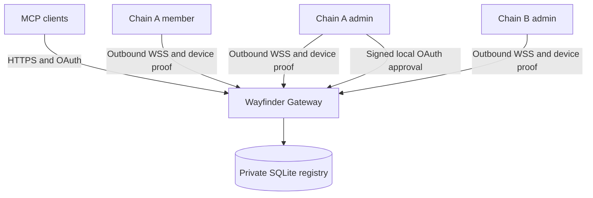

# Sync Chain architecture, version 1

## Components and boundaries

- `wayfinder-core`: identity, explicit protocol types, SQLite registry, OAuth flow,
  execution contracts and restrictive atomic file storage.
- `wayfinder-agent`: outbound WebSocket lifecycle and local shell dispatch.
- `wayfinder-exec`: fresh shell, bounded output, deadline and process-group cleanup.
- `wayfinder-mcp`: official rmcp Streamable HTTP server and OAuth HTTP endpoints.
- `wayfinder-gateway`: shared registry/session routing and hosted/self-hosted binary.
- `wayfinder`: enrollment, local approval, device/grant administration and terminal UI.

All generic implementation is Apache-2.0 in this repository. The
Wayfinder-Cloudflare repository contains only hosted ingress/deployment. No
Cloudflare data store, account identifier or hostname participates in identity.



## Identity construction

All hex below is lowercase, full-length; Ed25519 public keys are 32 bytes and
signatures 64 bytes. Signing uses `ed25519-dalek`, strict verification, and its
zeroize feature. Entropy and key generation use the OS CSPRNG. Recovery encoding
uses the established English BIP39 24-word/256-bit-entropy checksum format, via
`bip39`. A BIP39 passphrase extension is not used.

```text
entropy = OS random 32 bytes
phrase  = BIP39 English mnemonic(entropy), 24 words
root_seed = HKDF-SHA256(
    IKM  = entropy,
    salt = UTF8("wayfinder/sync-chain/v1"),
    info = UTF8("root-signing/ed25519"),
    L    = 32)
root_key = Ed25519(root_seed)
ChainID = "wfc1_" + hex(SHA256(
    UTF8("wayfinder/chain-id/v1\0") || root_public_key))
DeviceID = "wfd1_" + hex(SHA256(
    UTF8("wayfinder/device-id/v1\0") || device_public_key))
```

The phrase decodes to entropy rather than using BIP39's wallet seed/PBKDF2 step.
HKDF provides the explicit application/version separation. Chain ID is stable
across gateways and devices, not reversible to recovery material. It exposes no
private seed. A public key alone cannot sign enrollment certificates.

Each installation generates a new independent random 32-byte Ed25519 device
seed. Enrollment signs a membership certificate with the transient root key.
The certificate's exact signed byte encoding is:

```text
UTF8("wayfinder/membership/v1\0")
|| u32be(version = 1)
|| string(ChainID)
|| root_public_key[32]
|| string(DeviceID)
|| device_public_key[32]
|| role[1]                 # 1 = admin, 2 = member
|| string(device_name)
```

`string(s)` is `u32be(UTF8 byte length) || UTF8(s)`. The signature field is
excluded. JSON object ordering never determines certificate signatures. Verify
version, name, both public-key-to-ID relationships and root signature before use.
Stored certificate bytes cannot be replaced for an existing `(chain, device)`.
Certificates have no expiry; explicit durable revocation is authoritative.
A revocation tombstone cannot be cleared by replaying or re-signing membership.
A phrase holder can always enroll a **new** device, including an administrator.

The first device is admin; joins default to member. Only admins can inspect and
approve pairing requests, enumerate/revoke grants, or revoke devices. Members
can list chain devices and receive commands. Role changes require fresh enrollment.
If all admins are lost, the phrase can enroll a new admin. Root compromise requires
a new chain; no root rotation, QR encoding or revocation federation is implemented.

## Local storage

One `installation.json` contains version, gateway URL, public certificate and
this device's private seed. It contains no phrase or root private material.
Corrupt/missing identity fails explicitly; reconnect never creates an identity.
Root keys, phrases and entropy are transient and zeroized where practical.
JSON serialization/read buffers containing local secrets are zeroized as well.
The atomic writer uses create-new 0600 temporary files, fsync, rename and directory
fsync on Unix; private directories use 0700. A directory lock excludes duplicate
agents and configuration changes while the agent runs. `status.json` is a local
last-observed display, not an authentication source.

## Agent protocol

JSON frames have explicit tagged schemas. Connect outward to `/agent` using WSS.
The gateway sends `{type: challenge, version: 1, gateway, nonce}`. Its nonce is
256 random bits, scoped to that socket, expires in 5 seconds, and is consumed
by the single authentication frame. The device verifies the exact configured
gateway origin and version, then signs:

```text
UTF8("wayfinder/session/v1\0")
|| string(gateway_origin)
|| string(nonce_lowercase_hex)
|| string(hex(SHA256(certificate_signed_bytes)))
```

The authentication frame carries only certificate and signature. The gateway
verifies possession before registering the chain/device, rejects revoked devices,
and sends `ready`. The gateway then routes `exec`, `cancel`, and `result` frames.
A new connection for the same `(chain, device)` closes the previous one. Session
cleanup checks its generation so an old socket cannot erase a new connection.
`ping`/`pong` every 15 seconds maintain liveness; a 45-second lapse closes the
session. Reconnect backs off from 1 to 30 seconds with up to one second of jitter,
reset after a stable minute. No different gateway or chain is tried.

Each connection holds a bounded dispatch channel. The agent allows 16 concurrent
commands, gateway limits pending dispatches and 1,024 simultaneous connections.
Shell output is capped to 1 MiB per stream. Device messages have bounded sizes.
A command is dispatched once: lost responses report an **unknown outcome** and
never trigger replay. Cancellation on MCP HTTP disconnect propagates to the
agent; dropping sessions cancels execution tasks and kills process groups.
Cancellation is best effort over a failed network, bounded by command timeout.

## Chain isolation and persistence

SQLite uses foreign keys, FULL synchronous commits, a rollback journal and an
exclusive process directory lock. A single host owns the database; live sessions,
nonces, pending OAuth requests and authorization codes stay in memory. Restart
invalidates pending challenges/codes, while agents reconnect and grants survive.
There is one current schema, no migration or obsolete-format reader.

- `chains(id, root)` stores only public root identity.
- `devices(chain, id, certificate, revoked, last_seen)` has composite primary key.
- `clients(id, info, secret_hash)` holds registered OAuth metadata.
- `grants(chain, id, record)` stores chain/client/scopes, expiration and revocation.
- `tokens(hash, chain, grant_id)` resolves opaque tokens to that composite grant key.

All device and grant administration uses the caller's verified Chain ID. MCP
extracts the chain exclusively from the authenticated grant, never request input.
Token lookup first derives its chain from the unguessable hashed token index and
joins on **both** chain and grant ID. Session routing uses `(Chain ID, Device ID)`.
Stable IDs outside the authorized chain and ambiguous names fail. Public OAuth
clients are global metadata; they confer no access without local chain approval.

## Signed administration and OAuth

Administrative HTTP operations request an opaque challenge from `/device/challenge`.
It contains a 30-second deadline, 256 random bits and an HMAC-SHA256 tag under a
process-local random gateway key. Issuance allocates no server state. After MAC,
expiry, device signature, active certificate, role and live-session validation,
the gateway records consumption in a per-device replay cache (at most 128
unexpired consumption records). The cache survives reconnects; gateway restart rotates the MAC key,
invalidating every outstanding challenge. A forged request cannot consume another
device's challenge. The proof is:

```text
UTF8("wayfinder/administration/v1\0")
|| string(gateway_origin) || string(nonce)
|| string(hex(SHA256(certificate_signed_bytes)))
|| string(operation_json)
```

`operation_json` is compact UTF-8 serialization of the typed Operation enum, tag
`operation` first, then fields in declaration order. Unknown fields are rejected;
all operation fields are strings, so there are no numeric/map normalization rules.
The registry requires the exact active certificate and a live session. Sensitive
operations require admin role. Enrollment/session installation and administration
are serialized to prevent an admin revocation/approval race.

OAuth binds exact registered redirect, client ID, resource origin, S256 challenge,
state, requested scopes and expiry into one pending request. A 48-bit display code
identifies it; the browser holds a separate random 256-bit continuation ticket.
The device retrieves details and signs approval of their SHA-256 digest, including
client ID, redirect, scopes, request ID and expiry. Human approval is explicit.
The request is consumed once. An approved chain is carried into a one-minute,
one-use authorization code and finally a durable grant. Access/refresh secrets
are independent OS-random 256-bit values, indexed/stored only by SHA-256. Refresh
rotates both tokens; reuse of a spent refresh token revokes the grant family.

The browser UI has no phrase input, no JavaScript, no third-party resources, no
cache, no referrer and no frame embedding. Refreshing the page after local approval
returns the OAuth redirect with the original state and issuer. Dynamic registration
supports public and confidential clients. Pairing lookups are limited to ten per
device per minute. Public registrations live in memory for one hour (1,024 total)
and become durable only when a chain-approved code issues a grant. Durable clients
remain usable while any associated grant is within its absolute 30-day refresh
lifetime. A minute maintenance tick removes expired flows/registrations, expired
grant/token records and unreferenced clients. Refresh replay records remain until
the entire grant expires, including when revoked. Device tombstones never expire.

Unapproved OAuth requests retain their ten-minute lifetime with at most four per
client and 1,024 overall. Approved requests and one-minute codes have a separate
1,024-slot budget, at most 16 per chain. Unauthenticated traffic cannot consume
that approved capacity. Transient registrations and flows are lost on restart;
clients must register again if they had not obtained a grant.

Agent handshakes have a separate 128-slot budget and a five-second total deadline.
Only verified devices acquire the 1,024 authenticated-session slots; a chain may
hold at most 64 sessions. New durable device admission is limited to 60 per minute
globally and ten per chain, using monotonic process-local time. Existing devices
reconnect/heartbeat outside this budget, and revocations are never discarded.

These generic bounds complement source-based admission at the TLS ingress. Public
self-hosted gateways must configure equivalent source controls for `/agent`,
`/oauth/` and `/device/`; source headers never establish application identity.
Hosted deployment uses native edge rate limits. Accountless root creation cannot
prevent distributed Sybil attacks; these are proportionate controls, not a global
quota or a claim of distributed denial-of-service immunity.

## Security boundary

TLS authenticates the configured gateway; the gateway verifies device signatures
and membership without receiving private keys. Cloudflare terminates hosted TLS
and therefore shares the traffic trust boundary. The trusted gateway sees command
plaintext and results and decides which commands to send. A compromised gateway
could misuse an active agent's command channel or lie about grants/revocations;
ordinary MCP clients cannot provide end-to-end chain signatures/encryption.
Self-host if that operator trust is unacceptable. Device signatures do not make
the gateway incapable of command injection.

A compromised member key grants that device's membership and local OS access,
not administrative approval authority. A compromised admin can approve grants
and revoke devices; revoke its device **and** unwanted grants. A phrase holder
has root enrollment authority. Revocations are gateway-local and restore from
backup can restore earlier trust state: protect current backups and do not treat
a fresh gateway as carrying historical revocations. Protect machine backups,
terminal scrollback, swap/core dumps and service OS accounts accordingly.
